# Architecture and operational boundaries

## Incident loop

```mermaid
flowchart LR
    Demo[Isolated demo slot and database] --> Monitor[Azure Monitor query alerts]
    Monitor --> SRE[Separate opt-in Azure SRE Agent]
    SRE --> Issue[Trusted structured GitHub incident]
    Issue --> Gate[Policy, origin, fingerprint and auth checks]
    Gate --> Copilot[Accepted Copilot cloud-agent task]
    Copilot --> PR[Fix PR with positive regression coverage]
    PR --> Human[Human review and workflow approval]
    Human --> CI[Exact-commit CI gates]
    CI --> Deploy[Approved deployment]
    Deploy --> Verify[Original endpoint plus schema and identity checks]
    Verify --> Evidence[Durable issue evidence and workflow artifacts]
    Evidence --> SRE
```

Every edge has a distinct configuration and evidence boundary. ARM deployment does
not consent to a connector. A label does not start Copilot. An HTTP 200 is not proof
of schema readiness. A fix PR is not a deployed fix. A slot swap does not undo
database changes. The evidence viewer must show missing or pending hops rather
than infer success from the preceding hop.

## Application and telemetry

`src/main.py` configures FastAPI and optional Azure Monitor OpenTelemetry.
`src/database.py` supplies async SQLAlchemy sessions; handlers use dependency
injection and explicit not-found responses. `src/version.py` reads immutable
`src/build_info.json` from the deployed artifact. Build identity follows the code
during a swap; environment, database, telemetry and demo settings stay with the slot.

`/live` has no database dependency. `/ready` and its compatibility alias `/health`
query `alembic_version` and the actual task columns, under a bounded timeout. They
return 503 on missing schema, wrong revision, database failure or missing deployed
commit identity. Failed sessions are rolled back so subsequent requests can recover.
Their response is not cacheable.

Requests log environment, deployed SHA, demo run ID and validated correlation ID.
When an actual OpenTelemetry span exists, its trace ID is returned and logged;
without tracing the trace ID is absent, not fabricated. Exception telemetry includes
the real traceback, error class, endpoint and the same context. Credentials and
arbitrary request bodies are not public evidence.

Azure alert rules evaluate the **demo** request stream over five minutes, with at
least 20 observed nonprobe records: weighted server-error ratio strictly greater than 5%, or p95
duration strictly greater than 3,000 ms. Health probes are excluded. Query resources,
sampling policy, evaluation cadence and ingestion caveats live with the infrastructure
and response plan. These are not a five-error count or an average-latency policy.

## Database lifecycle

The initial revision is `0001_tasks`; no application or test fixture uses `create_all`
to conceal missing revisions. Fast SQLite tests apply Alembic; PostgreSQL service
tests exercise fresh-database migration, repeat upgrade, concurrent migration
serialization, HTTP CRUD with committed transactions, and actual restricted
migrator/runtime grants (runtime cannot create tables or write migration metadata).

Online PostgreSQL migrations acquire a transaction-scoped advisory lock before
Alembic inspects or changes the revision. DDL locking and statement execution are
bounded. The supported executor is Python/Alembic on an ephemeral runner that has
private database reachability and the environment's narrowly scoped migrator
credential. Neither interactive `az webapp ssh` nor undocumented remote-command
support is used.

Production, staging and demo have separate logical databases and runtime/migrator
roles on the same server. Migrations initialize **each** database independently.
The staging smoke test checks the environment and build before creating data, and
only deletes its own UUID/marker-verified sample. Production verification is read-only.
An ambiguous network failure while creating a sample is a failed check requiring
operator reconciliation; it must never trigger a broad cleanup query.

Use expand/contract schema changes. An automatic application rollback is supported
only when the previous application's observed schema revision matches the new
artifact's revision. Future schema upgrades need an explicit compatibility and
data-recovery plan. `alembic downgrade` exists for disposable database development;
CD never runs it. Backups/PITR and data restoration are separately approved operations.

## Delivery trust boundaries

`ci.yml` runs lint/format, types, unit/mocked integration tests, a fresh PostgreSQL
service suite, locked dependency audit, and Bicep/workflow/shell validation.
Only a successful default-branch push can package and call `cd.yml`.

The reusable CD workflow receives an immutable SHA and downloads the artifact from
the **same run**. It never deploys a pull-request artifact via `workflow_run`, never
executes issue text, and never grants deployment credentials to untrusted PR jobs.
Package manifests bind the code and build identity to the gated commit. App Service
installs the pinned runtime requirements, rather than resolving a new dependency
graph during release.

A single non-cancelling concurrency group covers the whole release, including
approval, migration and swap, and the isolated demo workflow. This prevents another
release from replacing staging while production approval is pending. GitHub can
replace an older *pending* concurrency run; a running migration/swap is not
automatically cancelled. Operator cancellation still requires reconciliation.

Before Azure writes, a read-only GitHub preflight verifies the latest default-branch
head and restricted staging/production branch policies. Production requires reviewers,
prevented self-review and disabled administrator bypass. It rechecks after an
approval wait. Configure these protections explicitly; the repository never changes
them automatically. Reviewers, self-review prevention and branch restrictions are
API-verified. The published REST environment response does not expose administrator
bypass; `ADMIN_BYPASS_DISABLED_CONFIRMED=true` is an explicitly labelled operator
attestation after checking that setting in GitHub, not an invented API guarantee.

Staging and production use separate GitHub environments and OIDC identities. Deploy
jobs use ephemeral, single-use Linux runners with network access; untrusted PR CI
stays on hosted runners without Azure credentials. Runner isolation is an operator
prerequisite, not something a repository variable can technically prove.

Production captures the previous healthy build, applies its database migration,
swaps the tested application, and verifies exact identity, schema and task reads.
It also verifies staging's old artifact and isolated database were restored.
An initial deployment cannot verify an absent old app; that boundary is explicit.
Failed staging restoration stops for reconciliation without blindly swapping again.
A supported app failure swaps back and verifies the previous build, while still
failing the attempted release. An uncertain control-plane swap result is never
blindly retried with another reciprocal swap. The initial deployment has no known-good
app to restore and requires explicit bootstrap acknowledgement.

## Isolation is deliberate, not unlimited

The optional demo slot cannot promote itself and uses its own database and telemetry.
Its regression branch preserves the positive test. The dedicated demo workflow
proves the expected regression, never relaxes the production pipeline, and deploys
only after demo-environment approval. Recovery must make the original endpoint pass
with the scenario still enabled.

Slots share an App Service plan, and logical databases share a PostgreSQL server.
They are not independent capacity/fault domains or hostile-tenant security boundaries.
Bounded traffic is for a controlled demo, not load/chaos testing. Slot warm-up also
requires careful Key Vault identity/access configuration; follow the documented
operator setup before relying on swaps.

## Durable evidence and manual boundaries

Validated incident metadata and issue comments hold incident, issue, accepted
handoff, PR and recovery evidence. Deployment and smoke JSON artifacts retain
observed commit, schema, environment, endpoint and timestamps through restarts and
rollbacks. Artifact retention is finite; export them for longer retention. There is
no unauthenticated evidence-writing endpoint or in-memory source of truth.

SRE model availability/consent, external connectors, response-plan activation, source
control policy, and Copilot preview entitlement/authentication require operator
configuration. The runbook provides manual investigation/assignment/evidence paths
when these hops are disabled or unavailable. Copilot-created PR workflow runs can
require an authorized human's approval before they run; a draft PR is not a passing
CI or review gate.

See [Azure setup](azure-setup.md), [SRE setup](sre-agent-setup.md), and the
[presenter guide](../demo/README.md) for concrete commands and recovery procedures.
